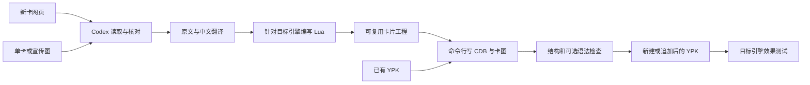

# 设计与后续边界

两个入口共用卡片工程：网页批量识别和图片单卡识别，均输出原文、翻译、参数、Lua、图片、来源及未决项。新建和追加只改变封包方式。

技能负责模型判断，工具负责确定性的处理。“读卡”和“理解裁定”不属于图片转码或 SQLite 写入能力。命令行不自动编写卡效，完整两类输入通过 Codex 技能执行。

已有代码：新建、追加、读包、数据库、裁切/转码、临时 ID 建议与冲突扫描、结构/哈希检查、可选外部 Lua 语法检查。网页提取、卡文复核、翻译、编程和实测是 agent 工作流程，需要宿主工具及模型。

追加独立 CDB，保留原库自定义字段和未知资源，输出新文件可回退。旧卡替换需未来明确 ID 更新范围、旧清单和资源引用的同步，不能混入默认追加。

将来独立软件可复用 CLI，增加模型适配、任务状态、来源获取界面、逐卡审阅和引擎测试运行器。当前没有独立 GUI 或模型 API。
